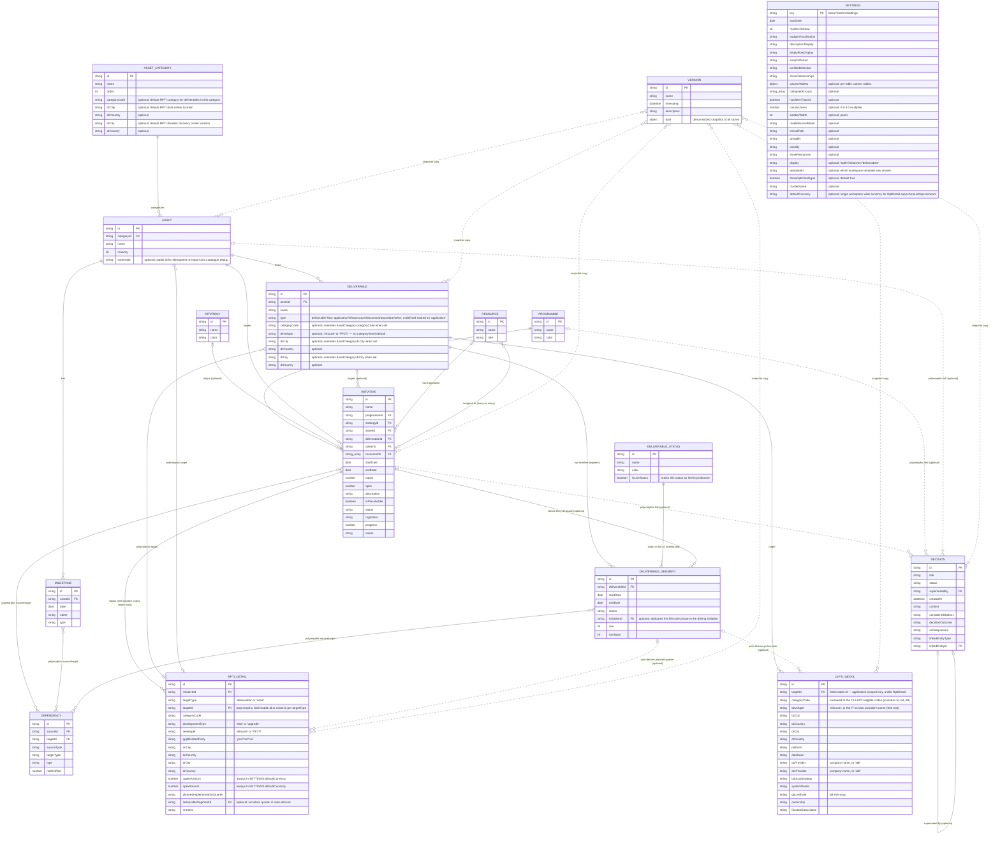
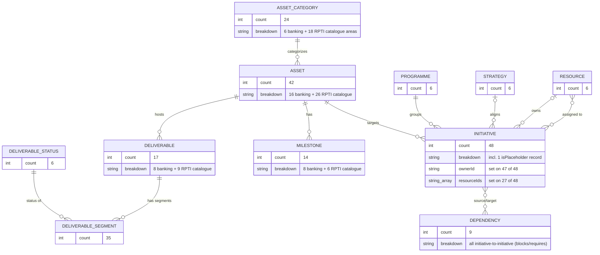
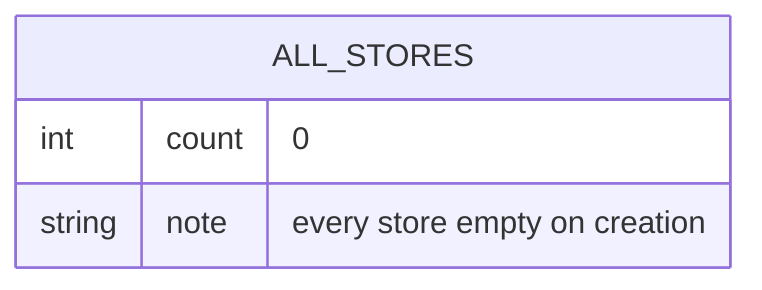

# Database Diagram

Selara persists all application data client-side in **IndexedDB**, accessed via the `idb` library. The database is defined in a single location: [`src/lib/db.ts`](../src/lib/db.ts).

- **Database name:** `it-initiative-visualiser`
- **Current schema version:** `18`
- **Object stores:** 15 (all key-path stores except `settings`, which uses an explicit out-of-line key)
- **Indexes:** none — all lookups are done via `getAll()` with in-memory filtering/joining on foreign-key-like fields (there is no `createIndex` usage anywhere in the codebase)

## Entity-Relationship Diagram

## Object Stores

| Store | Key path | Value type | Introduced |
|---|---|---|---|
| `assets` | `id` | `Asset` | v1 |
| `initiatives` | `id` | `Initiative` | v2 |
| `milestones` | `id` | `Milestone` | v3 |
| `programmes` | `id` | `Programme` | v4 |
| `strategies` | `id` | `Strategy` | v4 |
| `dependencies` | `id` | `Dependency` | v4 |
| `assetCategories` | `id` | `AssetCategory` | v4 |
| `settings` | *(out-of-line)* | `TimelineSettings` | v5 — single record, explicit key `'timelineSettings'` |
| `versions` | `id` | `Version` | v6 |
| `resources` | `id` | `Resource` | v7 |
| `deliverables` | `id` | `Deliverable` | v8 — renamed from `applications` at v17; see Migration Notes |
| `deliverableSegments` | `id` | `DeliverableSegment` | v9 — renamed from `applicationSegments` at v17; see Migration Notes |
| `deliverableStatuses` | `id` | `DeliverableStatus` | v10 — renamed from `applicationStatuses` at v17; see Migration Notes |
| `dtsPhases` | `id` | `DtsPhaseRecord` | v13 — orphaned; see Migration Notes |
| `decisions` | `id` | `Decision` | v14 |
| `rptiDetails` | `id` | `RptiDetail` | v15 |
| `lkptiDetails` | `id` | `LkptiDetail` | v19 |

## Relationships

Since IndexedDB has no native foreign-key enforcement, all relationships below are informal — fields that hold the `id` of a record in another store, resolved in application code:

- `Asset.categoryId` → `AssetCategory.id`
- `Deliverable.assetId` → `Asset.id`
- `DeliverableSegment.deliverableId` → `Deliverable.id`
- `DeliverableSegment.status` → conceptually maps to `DeliverableStatus.name`/`id`, but stored as a free string (not enforced)
- `Initiative.programmeId` → `Programme.id`
- `Initiative.strategyId` (optional) → `Strategy.id`
- `Initiative.assetId` → `Asset.id`
- `Initiative.deliverableId` (optional) → `Deliverable.id`
- `Initiative.ownerId` (optional) → `Resource.id`
- `Initiative.resourceIds` (optional array) → `Resource.id[]` (many-to-many)
- `Milestone.assetId` → `Asset.id`
- `Dependency.sourceId` / `Dependency.targetId` → polymorphic; resolved via `sourceType`/`targetType` (`'initiative' | 'milestone' | 'segment'`) to `Initiative.id`, `Milestone.id`, or `DeliverableSegment.id`
- `Decision.linkedEntityId` (optional) → polymorphic; resolved via `linkedEntityType` (`'initiative' | 'programme' | 'asset'`) to `Initiative.id`, `Programme.id`, or `Asset.id`. Unlike `Dependency`, a decision links to at most one item.
- `Decision.supersededBy` (optional) → `Decision.id` — set when a later decision replaces this one.
- `RptiDetail.initiativeId` → `Initiative.id`
- `RptiDetail.targetId` (with `targetType: 'deliverable' | 'asset'`) → polymorphic; resolved to `Deliverable.id` or `Asset.id`. In Data Manager, `targetType` is not directly editable — it's re-derived automatically from whichever list (`deliverables` or `assets`) the current `targetId` is found in, so the two fields can never fall out of sync via inline editing.
- `RptiDetail.deliverableSegmentId` (optional) → `DeliverableSegment.id` — set when the row's quarter was auto-derived from a lifecycle segment at export time (see [ADR-0005](adr/0005-rpti-data-manager-tab.md)).
- `LkptiDetail.targetId` → `Deliverable.id` — application-scoped only, unlike `RptiDetail`'s polymorphic target.
- `Version.data` embeds a denormalized, point-in-time snapshot of every other store (assets, deliverables, deliverableSegments, initiatives, milestones, programmes, strategies, dependencies, assetCategories, timelineSettings, resources, deliverableStatuses, decisions, rptiDetails, lkptiDetails) — this is how backup/restore and version history are implemented. `dtsPhases` is not included — it was dropped from `Version.data` when DTS was removed (see Migration Notes). The `versions` store itself is not part of the regular `getAppData`/`saveAppData` load-save cycle; it's managed separately via `saveVersion`/`getAllVersions`/`deleteVersion`.

## Migration Notes

Schema evolution is handled in the `upgrade()` callback of `openDB<ITMapDB>()` in `src/lib/db.ts`. Notable non-additive migrations:

- **v11:** Legacy `DeliverableSegment` records that carried `assetId` + `label` fields were rewritten into proper `Deliverable` records with `deliverableId`, and the old fields were dropped.
- **v12:** `Initiative.budget` (single field) was split into separate `capex` and `opex` fields, defaulting `opex` to `0`.
- **v13:** Added the `dtsPhases` store and seeded 5 default `DtsPhaseRecord`s (`phase-1`, `phase-2`, `phase-3`, `back-office`, `not-dts`) for workspaces that already contained assets whose `alias` starts with `"DTS."`. **This store is now orphaned:** the DTS workspace feature was removed (see [ADR-0004](adr/0004-remove-dts.md)), and all application code that read or wrote `dtsPhases` was deleted along with it. Per this app's additive-only migration history, the store's creation logic was simply not carried forward for new databases — no `deleteObjectStore` was called, so any database that already reached v13+ keeps its (now-inert) `dtsPhases` store forever. `DB_VERSION` was not bumped for this removal.
- **v14:** Added the `decisions` store (no seeding — always empty on creation) to support the in-app portfolio decision log. See [ADR-0002](adr/0002-in-app-decision-log.md).
- **v15:** Added the `rptiDetails` store (no seeding) and a `type` field on `Deliverable`, to support the RPTI regulatory report. See [ADR-0003](adr/0003-rpti-report-and-application-type.md).
- **v16:** Flattened `RptiDetail.location` (a nested `{ dataCenter: {city, country}, disasterRecoveryCenter: {city, country} }` object) into four top-level fields — `dcCity`, `dcCountry`, `drCity`, `drCountry` — so the field could be edited inline in Data Manager, whose `EditableTable` component only supports flat columns. Existing `rptiDetails` records with a `location` value are rewritten in place: their nested fields are copied to the new top-level fields and `location` is removed. See [ADR-0005](adr/0005-rpti-data-manager-tab.md).
- **v17:** `Application`/`ApplicationSegment`/`ApplicationStatus` were renamed to `Deliverable`/`DeliverableSegment`/`DeliverableStatus` throughout the codebase (the entity covers more than software applications — infrastructure, documents, procedures, etc. — see [ADR-0003](adr/0003-rpti-report-and-application-type.md)), and their object stores renamed to match (`applications` → `deliverables`, `applicationSegments` → `deliverableSegments`, `applicationStatuses` → `deliverableStatuses`). `RptiTargetType`'s `'application'` value became `'deliverable'`. **No data migration was performed** — new stores are created under the new names (for both fresh databases and existing ones upgrading through v17), and the old `applications`/`applicationSegments`/`applicationStatuses` stores are left in place, orphaned and unmigrated, on any database that already had them — same treatment as `dtsPhases` at v13.
- **v18:** Currency became a single workspace-wide fact (`SETTINGS.defaultCurrency`) instead of a per-row one — `RptiDetail.capexCurrency`, `opexCurrency`, `capexIdrEquivalent`, and `opexIdrEquivalent` were removed from the type. Existing `rptiDetails` records with any of those four fields set have them stripped in place (read-all/rewrite-all, same pattern as v16). `AssetCategory` and `Deliverable` both gained new optional auto-fill fields (`categoryCode`, `dcCity`/`dcCountry`/`drCity`/`drCountry`; `Deliverable` additionally `developer`) — additive, no migration needed. See [ADR-0006](adr/0006-rpti-auto-fill-and-single-currency.md).
- **v19:** Added the `lkptiDetails` store (no seeding) to support the LKPTI Format 3.2.6 Report — additive, no data migration needed. See `requirement-specs/lkpti-integration.md`.

## Source of Truth

All database access is centralized in [`src/lib/db.ts`](../src/lib/db.ts); entity type definitions live in [`src/types.ts`](../src/types.ts). No other file in the codebase touches IndexedDB directly — consumers use the exported helpers (`initDB`, `getAppData`, `saveAppData`, `saveVersion`, `getAllVersions`, `deleteVersion`).

---

## Workspace Templates

On first load (or when re-opened from Data Manager's "change template" action), an empty workspace is offered a choice of **starter templates** via `TemplatePickerModal` (`src/components/TemplatePickerModal.tsx`). The selection is handled by `getTemplateData(templateId, withDemoData)` in [`src/lib/workspaceTemplates.ts`](../src/lib/workspaceTemplates.ts), which assembles a full `TemplateAppData` payload that is written into every IndexedDB store via `saveAppData`. `TimelineSettings.templateId` records which template was chosen (informational only).

There are three templates:

| id | Name | Demo-data toggle? | Source data |
|---|---|---|---|
| `rpti` | Indonesian Bank Technology Catalogue | Yes | [`src/demoData.ts`](../src/demoData.ts) |
| `viewer` | Viewer (upload & view a file) | No | none — empty shell, populated later from an imported Excel file |
| `blank` | Blank | No | none — empty shell |

Each template exercises a different *subset* of the schema described above. The diagrams below show, per template, exactly which stores get populated and which relationships are actually exercised — as opposed to the full schema diagram, which shows everything the app is *capable* of storing.

No template pre-seeds `decisions`, `rptiDetails`, or `lkptiDetails` — every template (`rpti`, `viewer`, `blank`, with or without demo data) sets all three to `[]`. Decisions and both regulatory reports' rows are user-authored (or generated on demand) records added after the workspace is set up, so they're omitted from the per-template diagrams below.

### `rpti` — Indonesian Bank Technology Catalogue (with demo data)

`timelineSettings.showRptiCatalogue` is `true` in this template, which lets the user browse and add from the live 18-area / 39-asset-type RPTI taxonomy in [`src/lib/rptiCatalogue.ts`](../src/lib/rptiCatalogue.ts) — `rptiCatalogueAreas` (the example asset lists) is rendered directly by the Timeline UI and is **not** seeded into IndexedDB, but `rptiCatalogueAssetCategories` (the 18 backing `AssetCategory` records) **is** seeded, so any Deliverable a user adds under a catalogue asset auto-classifies for RPTI reporting.

### `rpti` — without demo data

Selecting `rpti` with the demo-data toggle off still seeds the lookup/config stores (categories, assets, programmes, strategies, statuses) but leaves all relationship-bearing record stores empty for the user to fill in:

| Store | Count |
|---|---|
| `assetCategories` | 24 |
| `assets` | 42 |
| `programmes` | 6 |
| `strategies` | 6 |
| `deliverableStatuses` | 6 |
| `initiatives` | 0 |
| `milestones` | 0 |
| `deliverables` | 0 |
| `deliverableSegments` | 0 |
| `dependencies` | 0 |
| `resources` | 0 |

### `viewer` and `blank` — empty shells

Both templates produce an identical, fully-empty `TemplateAppData` payload — no categories, assets, programmes, strategies, or statuses are pre-seeded. They differ only in what happens next:

- **`blank`** stays empty; the user builds the workspace manually from the UI.
- **`viewer`** is immediately followed by an Excel-file import (`handleViewerImport` in `src/App.tsx`), which parses the uploaded file into the same entity shape and populates the stores from that external source rather than from `getTemplateData`.
