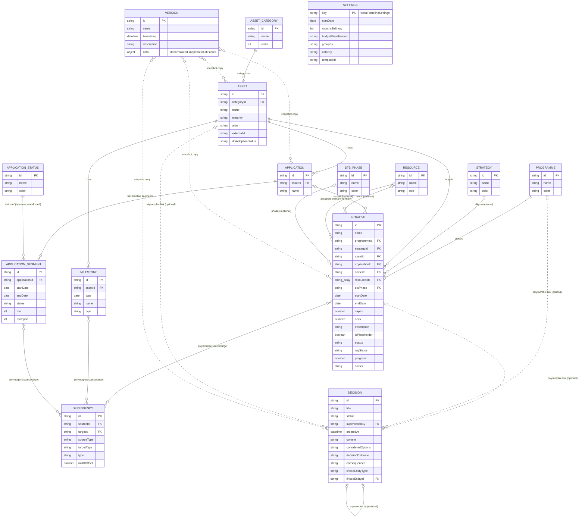
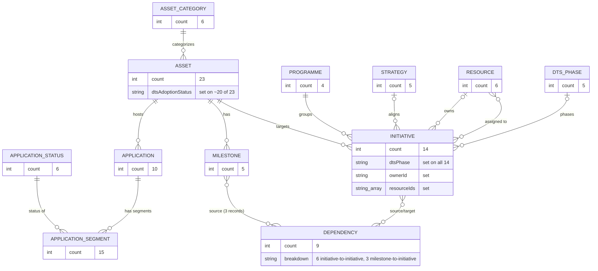
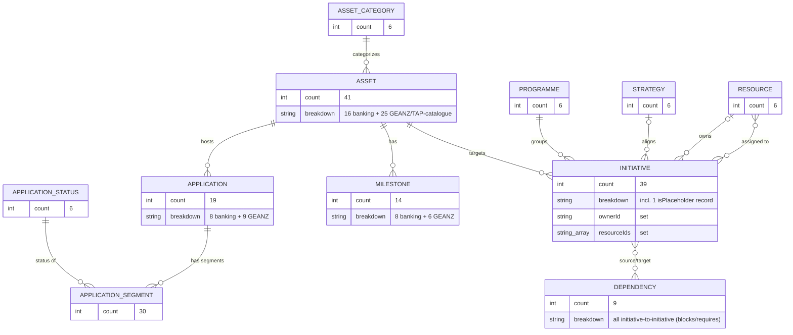
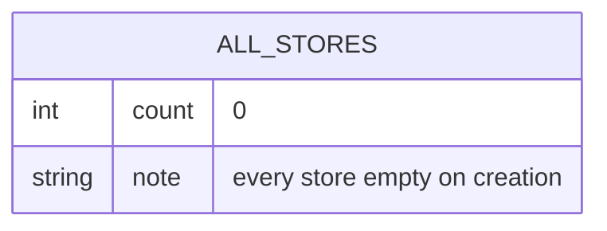

# Database Diagram

Scenia persists all application data client-side in **IndexedDB**, accessed via the `idb` library. The database is defined in a single location: [`src/lib/db.ts`](../src/lib/db.ts).

- **Database name:** `it-initiative-visualiser`
- **Current schema version:** `14`
- **Object stores:** 15 (all key-path stores except `settings`, which uses an explicit out-of-line key)
- **Indexes:** none — all lookups are done via `getAll()` with in-memory filtering/joining on foreign-key-like fields (there is no `createIndex` usage anywhere in the codebase)

## Entity-Relationship Diagram

## Object Stores

| Store | Key path | Value type | Introduced |
|---|---|---|---|
| `assets` | `id` | `Asset` | v1 |
| `initiatives` | `id` | `Initiative` | v2 |
| `milestones` | `id` | `Milestone` | v3 |
| `programmes` | `id` | `Programme` | v4 |
| `strategies` | `id` | `Strategy` | v4 |
| `dependencies` | `id` | `Dependency` | v4 |
| `assetCategories` | `id` | `AssetCategory` | v4 |
| `settings` | *(out-of-line)* | `TimelineSettings` | v5 — single record, explicit key `'timelineSettings'` |
| `versions` | `id` | `Version` | v6 |
| `resources` | `id` | `Resource` | v7 |
| `applications` | `id` | `Application` | v8 |
| `applicationSegments` | `id` | `ApplicationSegment` | v9 |
| `applicationStatuses` | `id` | `ApplicationStatus` | v10 |
| `dtsPhases` | `id` | `DtsPhaseRecord` | v13 |
| `decisions` | `id` | `Decision` | v14 |

## Relationships

Since IndexedDB has no native foreign-key enforcement, all relationships below are informal — fields that hold the `id` of a record in another store, resolved in application code:

- `Asset.categoryId` → `AssetCategory.id`
- `Application.assetId` → `Asset.id`
- `ApplicationSegment.applicationId` → `Application.id`
- `ApplicationSegment.status` → conceptually maps to `ApplicationStatus.name`/`id`, but stored as a free string (not enforced)
- `Initiative.programmeId` → `Programme.id`
- `Initiative.strategyId` (optional) → `Strategy.id`
- `Initiative.assetId` → `Asset.id`
- `Initiative.applicationId` (optional) → `Application.id`
- `Initiative.ownerId` (optional) → `Resource.id`
- `Initiative.resourceIds` (optional array) → `Resource.id[]` (many-to-many)
- `Initiative.dtsPhase` (optional) → `DtsPhaseRecord.id`
- `Milestone.assetId` → `Asset.id`
- `Dependency.sourceId` / `Dependency.targetId` → polymorphic; resolved via `sourceType`/`targetType` (`'initiative' | 'milestone' | 'segment'`) to `Initiative.id`, `Milestone.id`, or `ApplicationSegment.id`
- `Decision.linkedEntityId` (optional) → polymorphic; resolved via `linkedEntityType` (`'initiative' | 'programme' | 'asset'`) to `Initiative.id`, `Programme.id`, or `Asset.id`. Unlike `Dependency`, a decision links to at most one item.
- `Decision.supersededBy` (optional) → `Decision.id` — set when a later decision replaces this one.
- `Version.data` embeds a denormalized, point-in-time snapshot of every other store (assets, applications, applicationSegments, initiatives, milestones, programmes, strategies, dependencies, assetCategories, timelineSettings, resources, applicationStatuses, dtsPhases, decisions) — this is how backup/restore and version history are implemented. The `versions` store itself is not part of the regular `getAppData`/`saveAppData` load-save cycle; it's managed separately via `saveVersion`/`getAllVersions`/`deleteVersion`.

## Migration Notes

Schema evolution is handled in the `upgrade()` callback of `openDB<ITMapDB>()` in `src/lib/db.ts`. Notable non-additive migrations:

- **v11:** Legacy `ApplicationSegment` records that carried `assetId` + `label` fields were rewritten into proper `Application` records with `applicationId`, and the old fields were dropped.
- **v12:** `Initiative.budget` (single field) was split into separate `capex` and `opex` fields, defaulting `opex` to `0`.
- **v13:** Added the `dtsPhases` store and seeded 5 default `DtsPhaseRecord`s (`phase-1`, `phase-2`, `phase-3`, `back-office`, `not-dts`) for workspaces that already contained assets whose `alias` starts with `"DTS."`.
- **v14:** Added the `decisions` store (no seeding — always empty on creation) to support the in-app portfolio decision log. See [ADR-0002](adr/0002-in-app-decision-log.md).

## Source of Truth

All database access is centralized in [`src/lib/db.ts`](../src/lib/db.ts); entity type definitions live in [`src/types.ts`](../src/types.ts). No other file in the codebase touches IndexedDB directly — consumers use the exported helpers (`initDB`, `getAppData`, `saveAppData`, `saveVersion`, `getAllVersions`, `deleteVersion`).

---

## Workspace Templates

On first load (or when re-opened from Data Manager's "change template" action), an empty workspace is offered a choice of **starter templates** via `TemplatePickerModal` (`src/components/TemplatePickerModal.tsx`). The selection is handled by `getTemplateData(templateId, withDemoData)` in [`src/lib/workspaceTemplates.ts`](../src/lib/workspaceTemplates.ts), which assembles a full `TemplateAppData` payload that is written into every IndexedDB store via `saveAppData`. `TimelineSettings.templateId` records which template was chosen (informational only).

There are four templates:

| id | Name | Demo-data toggle? | Source data |
|---|---|---|---|
| `dts` | NZ Digital Target State | Yes | [`src/lib/dtsCatalogue.ts`](../src/lib/dtsCatalogue.ts) (categories/assets) + [`src/lib/dtsDemoData.ts`](../src/lib/dtsDemoData.ts) (demo records) |
| `geanz` | GEANZ Technology Catalogue | Yes | [`src/demoData.ts`](../src/demoData.ts) |
| `viewer` | Viewer (upload & view a file) | No | none — empty shell, populated later from an imported Excel file |
| `blank` | Blank | No | none — empty shell |

Each template exercises a different *subset* of the schema described above. The diagrams below show, per template, exactly which stores get populated and which relationships are actually exercised — as opposed to the full schema diagram, which shows everything the app is *capable* of storing.

No template pre-seeds `decisions` — every template (`dts`, `geanz`, `viewer`, `blank`, with or without demo data) sets `decisions: []`. Decisions are a user-authored log added after the workspace is set up, so they're omitted from the per-template diagrams below.

### `dts` — NZ Digital Target State (with demo data)

This is the only template that populates `dtsPhases` and sets `Asset.dtsAdoptionStatus` / `Initiative.dtsPhase`, and the only one whose demo data includes **milestone-sourced dependencies** (`Dependency.sourceType === 'milestone'`). `timelineSettings.showGeanzCatalogue` is `false`.

### `geanz` — GEANZ Technology Catalogue (with demo data)

`dtsPhases` stays empty and `Initiative.dtsPhase` / `Asset.dtsAdoptionStatus` are never set in this template. Instead, `timelineSettings.showGeanzCatalogue` is `true`, which lets the user browse and add from the live 17-area / 300+ asset-type GEANZ taxonomy in [`src/lib/geanzCatalogue.ts`](../src/lib/geanzCatalogue.ts) — that catalogue is rendered directly by the Timeline UI and is **not** seeded into IndexedDB.

### `dts` / `geanz` — without demo data

Selecting a template with the demo-data toggle off still seeds the lookup/config stores (categories, assets, programmes, strategies, statuses, DTS phases) but leaves all relationship-bearing record stores empty for the user to fill in:

| Store | `dts` (no demo data) | `geanz` (no demo data) |
|---|---|---|
| `assetCategories` | 6 | 6 |
| `assets` | 23 (no `dtsAdoptionStatus`) | 41 |
| `programmes` | 4 | 6 |
| `strategies` | 5 | 6 |
| `applicationStatuses` | 6 | 6 |
| `dtsPhases` | 5 | 0 |
| `initiatives` | 0 | 0 |
| `milestones` | 0 | 0 |
| `applications` | 0 | 0 |
| `applicationSegments` | 0 | 0 |
| `dependencies` | 0 | 0 |
| `resources` | 0 | 0 |

### `viewer` and `blank` — empty shells

Both templates produce an identical, fully-empty `TemplateAppData` payload — no categories, assets, programmes, strategies, statuses, or DTS phases are pre-seeded. They differ only in what happens next:

- **`blank`** stays empty; the user builds the workspace manually from the UI.
- **`viewer`** is immediately followed by an Excel-file import (`handleViewerImport` in `src/App.tsx`), which parses the uploaded file into the same entity shape and populates the stores from that external source rather than from `getTemplateData`.
