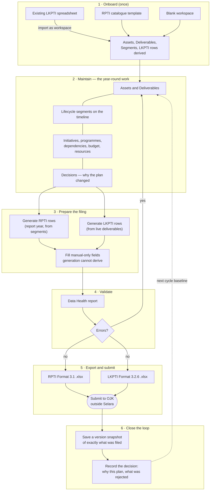
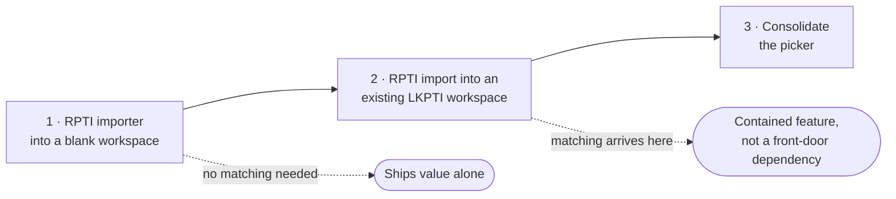

# The IT Planning Filing Cycle — Design Notes

> **Status:** Domain rules and the onboarding shape are **decided** (see below and
> confirmed with the product owner). Sequencing is agreed; nothing is implemented.
> The remaining open questions are listed at the end and are genuinely open.

## Who this is for

**IT Planning at an Indonesian bank** — the function that owns the IT portfolio and
prepares what the bank files with OJK. Not project delivery: IT Planning does not run
the initiatives, it holds the plan they belong to and is answerable for the return.

Whether that function is one person or several is an open question below, and it
matters more than it might appear: Selara is local-first with no accounts, so the
answer decides whether the current architecture fits the primary user at all.

Two obligations drive their year:

| | | |
|---|---|---|
| **RPTI** | OJK Format 3.1 | *Rencana* — the IT development **plan**. Forward-looking: what the bank intends to build. |
| **LKPTI** | OJK Format 3.2.6 (*Daftar Aplikasi*) | *Laporan* — the application **inventory**. Point-in-time: what is actually live. |

They answer different questions — *what will you do* versus *what do you have* —
and that difference drives everything below. RPTI is generated from planned and
in-flight lifecycle segments; LKPTI from deliverables that have already gone live.

## The cycle as Selara supports it today

Generation is **merge-preserving** (ADR-0010): re-running it keeps the manual-only
fields already filled in. That is what makes step 3 repeatable rather than a cliff
IT Planning falls off every time the plan moves.

## Decided: what each report covers

Confirmed against the OJK schemas in this repo and with the product owner. These
looked interchangeable from the outside and are not.

| | Scope | Category codes |
|---|---|---|
| **LKPTI** (3.2.6, *Daftar Aplikasi*) | **applications only** | `01-12`, `49` |
| **RPTI** (3.1) | **applications *and* infrastructure** | `01-12`, `49`, **plus `51-54`, `99`** |

The five extra RPTI codes exist purely to describe infrastructure —
`51` Data Center/DRC, `52` Servers and platforms, `53` Data communication network,
`54` Security systems, `99` Other infrastructure (`requirement-specs/rpti-schema.md:44-48`).
OJK states the asymmetry in its own column heading: the RPTI export's second column is
**`Nama Aplikasi/Infrastruktur Bank`** (`src/lib/rpti.ts:244`).

The code already matches this, in both directions:

- `src/lib/lkpti.ts:81` skips any deliverable whose `type` is not `application`, and two
  tests in `lkpti.test.ts` pin that rule.
- `generateRptiDetails` deliberately applies **no** type filter, which is correct rather
  than an oversight. Adding one would make codes `51-54`/`99` unfillable and cause the
  bank to **under-report its infrastructure plan**.

> Recorded because it is a trap: the missing filter in `rpti.ts` reads like the bug that
> `lkpti.ts:81` fixes. It is the opposite. Anyone "restoring symmetry" between these two
> functions would break the filing.

### The RPTI → LKPTI linkage rule

Every RPTI row must be associated with an Initiative **and** — when it describes an
application — with an item in the LKPTI. Keyed off the **category code**, not the
deliverable type:

- RPTI row with an application category (`01-12`, `49`) → **must** have an LKPTI counterpart
- RPTI row with an infrastructure category (`51-54`, `99`) → **must not**; LKPTI has nowhere to put it

Half of this is already structural: `RptiDetail.initiativeId` is non-optional
(`src/types.ts:203`). The LKPTI half is **enforced nowhere** — `dataHealth` checks only that
an RPTI row's initiative, target and segment still exist (`dataHealth.ts:237-256`).

Two obstacles to enforcing it:

1. `RptiDetail.targetType` allows `'asset'`, but `LkptiDetail.targetId` only ever points at
   a **Deliverable** — so an application-category RPTI row aimed at an Asset cannot satisfy
   the rule by construction.
2. Timing. An `upgrade` targets something already live, so the counterpart exists. A `new`
   build has no LKPTI row until go-live, because LKPTI is a point-in-time inventory and OJK
   rule 5.3 rejects a future `go_live_date` (this is what [#26](https://github.com/nofanto/Selara/issues/26) fixed).
   The rule therefore has to mean *the deliverable and segment must exist so it flows in on
   go-live*, not *it appears in the filing immediately*.

## Decided: onboarding

**Consolidate to two paths plus downloadable samples.**

| Path | |
|---|---|
| **Import LKPTI + RPTI** | the bank's last two filed returns |
| **Blank** | own structure |
| **Sample LKPTI and RPTI files** | replaces the demo workspace |

Samples rather than a demo workspace is the load-bearing choice: it makes the
**evaluation path and the real path the same path**. A prospective user downloads the
sample returns and imports them, exercising the real importer — so there is no demo mode
to escape, and no workspace that is half fabricated with nothing marking which half.

**Dropped from the picker:**

- **RPTI catalogue template** — nothing is lost. Catalogue assets can already be added from
  the Visualiser at any time (`Timeline.tsx:2349-2356`), and `externalId` dedup keeps it
  idempotent (`App.tsx:733-735`). The OJK taxonomy survives where it is more useful: during
  work, not at the door.
- **Viewer** — *rehomed, not deleted*. "Open a colleague's shared file" is a real job; it is
  simply not onboarding. It belongs on the import/share surface.

**Import order is LKPTI first, then RPTI.** Not simultaneous. LKPTI establishes what
exists; RPTI is then matched *against a known inventory* rather than two unknown lists being
merged into each other.

### Why this ships in three steps

Consolidating onto "import both" puts the hardest unbuilt feature in the product — matching —
on the critical path of the front door. Today's onboarding is flawed but works, so it is not
worth breaking for a destination that isn't built yet.

Step 1 is tractable: the RPTI export is 13 columns (`src/lib/rpti.ts:242-255`) and an
importer is its inverse, exactly as `lkptiImport` inverts the LKPTI export.

### Reconciliation is the point, not a chore

The two returns routinely disagree in practice. That mismatch is the most valuable thing
Selara can surface, not an obstacle to onboarding:

| | meaning |
|---|---|
| In RPTI, not in LKPTI | planned but never delivered — or delivered under another name |
| In LKPTI, not in RPTI | running but never planned — legacy, acquired, inherited |
| In both, **but inconsistent** | **the two returns contradict each other** |

The third is the dangerous one and the easiest to get wrong in code: if the names match but
the categories differ, the likely explanation is that these *are* the same application filed
inconsistently — not that they are different things. One comparison therefore has to answer
two questions independently (*same thing?* and *do the returns agree?*); conflating them
loses the finding.

Matching keys are **name + category code**, but the match itself is **judgement-based**. So
the matcher proposes and never decides, and each confirmed match is a durable judgement that
must survive re-import, an export/import round trip (the failure mode of
[#22](https://github.com/nofanto/Selara/issues/22)) and being wrong. Deliverable-level match
identity does not exist yet — `externalId` is on `Asset` only, for catalogue dedup.

Match records stay **out of the decision log**. Hundreds of them would flood it and destroy
the signal §6f of `decision-version-history-merge.md` exists to protect. A *contested* match
might warrant a decision record; routine ones never do.

## Decided: filings, revisions, and who prepares them

### One preparer, with contributions

IT Planning is **one person preparing the return**, with asset and application owners
feeding data in beforehand — typically as spreadsheets.

This is the answer that keeps the current architecture standing. Local-first, IndexedDB
per browser, no accounts and no concurrent editing all remain viable, and no backend is
required before the filing features are worth building.

What it does add is a **contribution path**: inbound rows from owners, with no stable
ids, matched on name and category by judgement. Which is the *same* problem as
reconciling RPTI against LKPTI. There are now three callers for one mechanism:

1. RPTI matched against an LKPTI-seeded inventory (onboarding)
2. Owner contributions merged into the preparer's workspace (every cycle)
3. Data Health triage at hundreds of rows

A matcher built for any one of these is a matcher built for all three, which is the
strongest argument yet for treating it as a product-level primitive rather than an
import detail.

### A revision is the whole report, and it is a saved Version

An amendment is a **revision of the same filing**, not a new filing and not a delta
against the previous one. Each revision is the complete return as at that submission.

Because the revision is complete, it is exactly what `Version` already stores — so
filings reuse the History feature rather than introducing a parallel snapshot mechanism:

| | |
|---|---|
| **Version** | an arbitrary workspace snapshot, taken whenever the user likes |
| **Filing revision** | a Version, plus submission metadata: report type, period, revision number, submitted date, status |

Sizes make this comfortable. A full workspace snapshot is **274 KB at 300 applications**
and 549 KB at 600 — only about twice the report rows alone. Ten filings at three
revisions each is roughly 8 MB, which IndexedDB will not notice. There is no reason to
store a trimmed report-only snapshot to save space.

What that buys with no new machinery:

- **Diff between two submissions** — `computeDiff` on their snapshots. The Difference
  Report, pointed at revisions instead of arbitrary saves.
- **Filed-versus-actual variance** — the same diff against current state, which closes
  the gap this document originally listed as missing.
- **"Why we amended" beside "what we filed"** — the decision log is already interleaved
  into the History tab, and `Decision.versionId` already links reasoning to a snapshot.
- **Reproducible exports** — `Version.data` carries `rptiDetails`, `lkptiDetails` and
  every input the export reads.

Still to build: the submission metadata itself, a third stream filter (Everything /
Decisions / **Filings**), and **deletion protection**. That last one is not cosmetic —
today any version is deletable behind a one-line confirm, and a filed snapshot is a
regulatory record. Losing it means losing what was told to OJK.

### Selara does not hold the submitted file

**The `.xlsx` actually sent to OJK is not maintained in Selara.** The flow ends at
generating the export; the sent artefact lives in the bank's own systems.

Stated plainly because it is easy to assume otherwise later: Selara is the record of
**what the portfolio looked like when a return was filed**, not a document store of
submissions. A revision can *regenerate* the return from its snapshot, but that is not
the same as reproducing the file that was sent — if export logic changes, a regenerated
2026 return is a *corrected* file, not the one OJK received.

Recording the app or export-format version on each revision would at least make that
discrepancy detectable rather than silent. One string field; worth considering, not
decided.

## What the model does not have yet

The diagram above has one dotted line and one rounded box, and both are load-bearing
gaps rather than cosmetic ones:

1. ~~**Selara has no concept of "filed".**~~ **Resolved in design, still unbuilt.** A
   filing revision is a saved `Version` plus submission metadata — see "Decided:
   filings, revisions, and who prepares them". The shape is settled; the code is not.
2. ~~**No filed-versus-actual view.**~~ **Falls out of (1) for free.** Variance is
   `computeDiff` between a revision's snapshot and current state — the Difference
   Report, pointed at a filing. No new machinery.
3. **The two reports have one workspace but different time anchors.** RPTI is about
   next year; LKPTI is about today. IT Planning may well be preparing one while the
   other is mid-cycle, and nothing in the app distinguishes those modes.

4. **The interface has never run at the size its user operates at.** Scale target is
   **hundreds** of applications. Measured on a production build: the computation is fine
   (generation and data health are linear — 6 ms / 6 ms / 12 ms at 600 deliverables) and so
   is the timeline (233 ms at 600). The RPTI and LKPTI tabs are not: at **300**
   applications the LKPTI tab renders **78,566** `<option>` elements and the RPTI tab
   **141,470**, taking 4.3 s to open — tracked as
   [#36](https://github.com/nofanto/Selara/issues/36). Demo data is 17 deliverables and no
   test exceeds it, so nothing would ever have surfaced it.
5. **Data Health scales as a computation and collapses as a workflow.** 1,240 issues at 300
   deliverables. A pre-filing checklist nobody can work through stops being used, exactly
   when the stakes are highest. It needs triage-by-exception — and so does the match review
   queue, and so do the Data Manager tables. One pattern, three features, currently built
   nowhere.

If RPTI and LKPTI become the product's goal rather than two of its reports, (1) is
the change that matters most — everything else can be built on top of a filing record,
and almost nothing can be built without one.

**#36 is a prerequisite for the samples**, not a background performance issue: a
realistically sized sample walks a prospective bank straight into the 4.3-second RPTI tab on
their first click, and an unrealistically small one misrepresents the product.

## Answered since the first draft

- **Scope of each report** — LKPTI is applications-only, RPTI covers applications and
  infrastructure. See "Decided: what each report covers".
- **Scale** — design for **hundreds** of applications. This turned a vague performance worry
  into [#36](https://github.com/nofanto/Selara/issues/36) with numbers attached.
- **Matching keys** — name + category code, but judgement-based, so the matcher proposes and
  a person decides.
- **Onboarding shape** — LKPTI + RPTI import, Blank, and downloadable samples.
- **Who prepares the return** — one person, with owners feeding data in. Local-first survives.
- **What an amendment is** — a revision of the same filing, carrying the whole report.
- **How submissions are stored** — as saved `Version` snapshots plus metadata, reusing History.
- **Where Selara's boundary sits** — it does not hold the `.xlsx` that was sent.

## Open questions

These need the domain knowledge, not a guess:

1. **Cadence.** Is RPTI annual and LKPTI something else — semi-annual, quarterly, on
   change? Do they share a submission window or move independently? The answer decides
   whether "filing" is one object or two.
2. **Sign-off.** Is there an internal review or approval gate before submission — risk,
   compliance, an executive signature? If so, does Selara need to represent that gate,
   or does it live in the bank's own process outside the tool?
3. **Variance.** Does OJK *ask* the bank to explain deviation from the filed plan? The
   capability now falls out of the filing design for free, but whether it deserves a
   dedicated screen depends on whether anyone is actually asked for it.
4. **Confirm the new-build timing reading.** This document assumes a *planned* application
   enters the LKPTI only once it has actually gone live — the deliverable and its segment
   exist so it flows in on go-live, rather than appearing in the filing while still planned.
   That reading is inferred from OJK rule 5.3 rejecting a future `go_live_date`, and
   [#26](https://github.com/nofanto/Selara/issues/26) was built on it. It has not been
   confirmed outright. If it is wrong, #26 needs revisiting.
5. **Is the filed RPTI machine-readable?** Step 1 of the onboarding sequence assumes IT
   Planning holds its last RPTI in the same Format 3.1 spreadsheet layout Selara exports. If
   what comes back from OJK is a PDF or a reformatted return, the importer needs a different
   input contract — or a different source entirely.

## Deliberately not proposed here

No data model and no screens. The onboarding **sequencing** is agreed (three steps above);
what each step contains as a change to `src/` is not, and should not be settled until the
open questions above — particularly revisions (2) and how many people are IT Planning (3) —
have answers. Both can invalidate a data model that looks obvious today.
